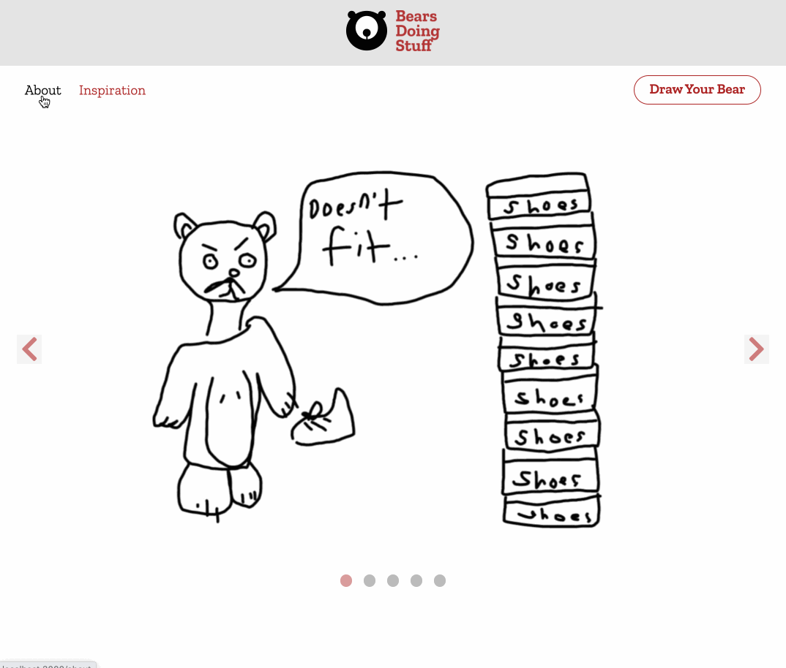

# bears-doing-stuff

A full stack JavaScript solo project for anyone with internet connection who wants to draw bears doing stuff!

## Technologies Used

- React.js
- Webpack
- Express
- React Router DOM
- PostgreSQL
- Bootstrap
- Node.js
- HTML5
- CSS3
- Heroku

## Live Demo

Try the application live at https://bears-doing-stuff.herokuapp.com/

## Features

- User can generate a random drawing prompt.
- User can draw image.
- User can select pen-size.
- User can select eraser-size.
- User can select drawing prompt.
- User can scroll through example images of bears doing stuff in a slideshow carousel.
- User can find out information about bears-doing-stuff.
- User can generate random images of bears for inspiration.

## Stretch Features

- User can undo last stroke.
- User can save image to their computer.
- User can share image with others.

## Preview



## Development

---

### System Requirements

- Node.js 10 or higher
- NPM 6 or higher
- PostgreSQL 12.6 or higher

### Getting Started

1. Clone the repository.

```shell
git clone git@github.com:Skim-329/bears-doing-stuff.git
cd bears-doing-stuff
```

2. Install all dependencies with NPM.

```shell
npm install
```

3. Make a copy of the provided .env.example file. Name your copy .env.
   switch all config variables to your project's variables.

```shell
cp .env.example .env
```

4. Import the database schema and test data using the provided "db:import" script in package.json.

```shell
pgweb --db=yourDatabase
```

5. Start the project. Once started, you can view the application by opening http://localhost:3000 in your browser.

```shell
npm run dev
```
